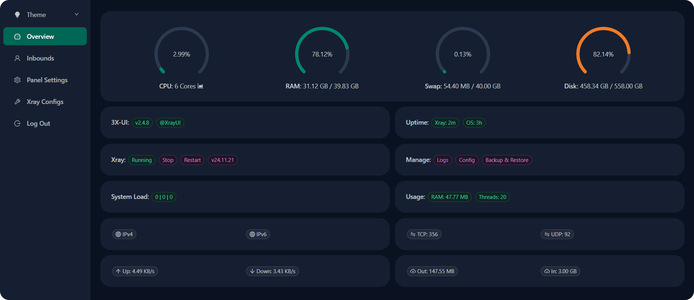
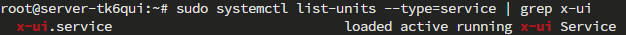
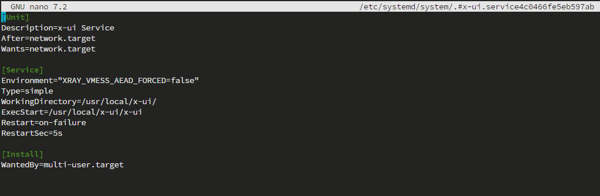
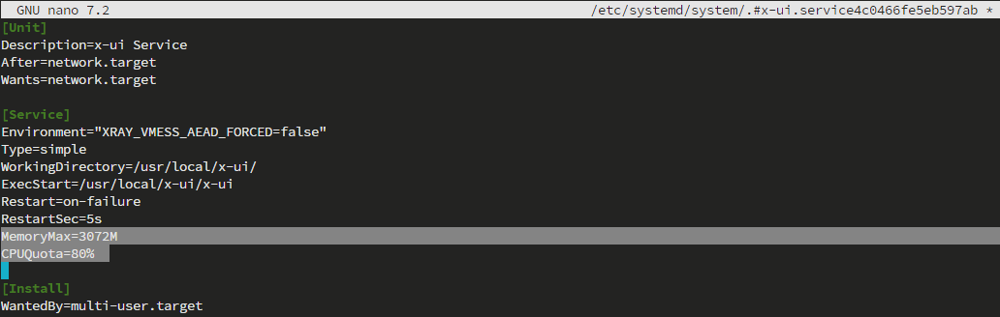
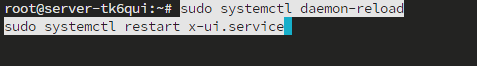
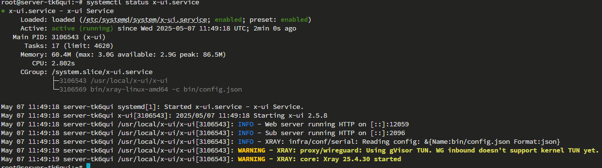

[English](/README_en_EN.md) | [Русский](/README.md)

<p align="center">
  <picture>
    <source media="(prefers-color-scheme: dark)" srcset="./media/logo-dark.png">
    
  </picture>
</p>

---

<div align="center">

[](https://github.com/AnikBeris)
[](https://github.com/AnikBeris/AutoRoleChannelBot/blob/main/LICENSE)
[](https://github.com/AnikBeris)

</div>

> **Отказ от ответственности:** Этот проект предназначен только для личного обучения.

**Если этот проект оказался полезным для вас, вы можете оценить его, поставив звёздочку.**:star2:

<p align="left">
  <a href="https://pay.cloudtips.ru/p/7249ba98" target="_blank">
    
  </a>
</p>

Пожертвования горячо приветствуются, какими бы маленькими они ни были, и большое спасибо. 😌

| | |
|-------------:|:-------------|
| **Bitcoin (BTC)** |`1Dbwq9EP8YpF3SrLgag2EQwGASMSGLADbh`|
| **Ethereum (ERC20)** | `0x22258ea591966e830199d27dea7c542f31ed5dc5`|
| **Binance Smart Chain (BEP20)** | `0x22258ea591966e830199d27dea7c542f31ed5dc5`|
| **Solana (SOL)** | `yYYXsiVTzsvfvsMnBxfxSZEWTGytjAViE2ojf3hbLeF`|
| **Cloud tips** | [cloudtips](https://pay.cloudtips.ru/p/7249ba98) |
---





# 🚀 Шаги для ограничения потребляемых ресурсов программы `3x-ui`:


### Найдем `systemd unit` файл:
вводим команду и делаем поиск, ищём все системные сервисы, которые могут быть связаны с `x-ui`:

```bash
sudo systemctl list-units --type=service | grep x-ui
```


---

### Отредактируем сервисный файл:

- Используем команду для редактирования существующего файла:

```bash
sudo systemctl edit --full x-ui.service
```


### Добавляем параметры ограничения:

- Найди секцию `[Service]` и добавь туда ограничения для памяти и процессора:

```bash
[Service]
MemoryMax=200M
CPUQuota=20%
```

- Вот, как будет выглядеть обновлённый файл:

```bash
[Unit]
Description=x-ui Service
After=network.target
Wants=network.target

[Service]
Environment="XRAY_VMESS_AEAD_FORCED=false"
Type=simple
WorkingDirectory=/usr/local/x-ui/
ExecStart=/usr/local/x-ui/x-ui
Restart=on-failure
RestartSec=5s
MemoryMax=3072M
CPUQuota=80%

[Install]
WantedBy=multi-user.target
```



- - Какие изменения внесли:

    `MemoryMax=2048M` — ограничиваем `x-ui` по потреблению `RAM`.

    `CPUQuota=80%` — ограничение `x-ui` по потреблению `CPU`.


- - После внесения изменений в файл, нажимаем:
     `Ctrl + O` - это `сохранит` изменения в файле.
     `Enter` - что бы подтвердить `имя` файла.
     `Ctrl + X` - что бы выйти из редактора.

---

### Перезагрузи `systemd` и перезапусти сервис:

- для этого вводим группу команд (одновременно или поочереди)

```bash
sudo systemctl daemon-reload
sudo systemctl restart x-ui.service
```


- Проверь статус сервиса:

```bash
systemctl status x-ui.service
```



