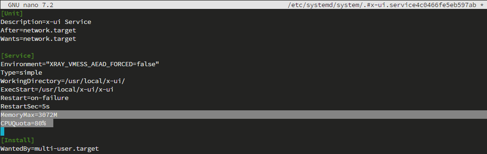
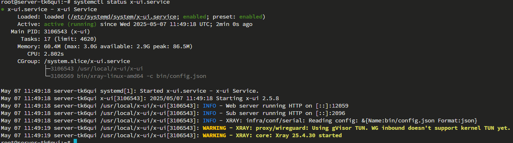

[English](/README_en_EN.md) | [Русский](/README.md)

<p align="center">
  <picture>
    <source media="(prefers-color-scheme: dark)" srcset="./media/logo-dark.png">
    
  </picture>
</p>

---

<div align="center">

[](https://github.com/AnikBeris)
[](https://github.com/AnikBeris/AutoRoleChannelBot/blob/main/LICENSE)
[](https://github.com/AnikBeris)

</div>

> **Disclaimer:** This project is intended for personal learning purposes only.

**If you found this project helpful, feel free to star it.** :star2:

<p align="left">
  <a href="https://pay.cloudtips.ru/p/7249ba98" target="_blank">
    
  </a>
</p>

Donations are warmly welcomed, no matter how small. Thank you very much. 😌

| | |
|-------------:|:-------------|
| **Bitcoin (BTC)** |`1Dbwq9EP8YpF3SrLgag2EQwGASMSGLADbh`|
| **Ethereum (ERC20)** | `0x22258ea591966e830199d27dea7c542f31ed5dc5`|
| **Binance Smart Chain (BEP20)** | `0x22258ea591966e830199d27dea7c542f31ed5dc5`|
| **Solana (SOL)** | `yYYXsiVTzsvfvsMnBxfxSZEWTGytjAViE2ojf3hbLeF`|
| **Cloud tips** | [cloudtips](https://pay.cloudtips.ru/p/7249ba98) |
---


# 🚀 Steps to Limit Resource Consumption for the `3x-ui` Application

### Locate the `systemd unit` file:

Run the following command to search for all system services related to `x-ui`:

```bash
sudo systemctl list-units --type=service | grep x-ui
```


---

### Edit the service file:

- Use the following command to edit the existing service file:

```bash
sudo systemctl edit --full x-ui.service
```


### Add resource limit parameters:

- Find the `[Service]` section and add the following resource constraints:

```bash
[Service]
MemoryMax=200M
CPUQuota=20%
```

- The updated service file should look like this:

```bash
[Unit]
Description=x-ui Service
After=network.target
Wants=network.target

[Service]
Environment="XRAY_VMESS_AEAD_FORCED=false"
Type=simple
WorkingDirectory=/usr/local/x-ui/
ExecStart=/usr/local/x-ui/x-ui
Restart=on-failure
RestartSec=5s
MemoryMax=3072M
CPUQuota=80%

[Install]
WantedBy=multi-user.target
```



- Changes made:

    `MemoryMax=2048M` — limits the RAM usage by `x-ui`.

    `CPUQuota=80%` — limits the CPU usage by `x-ui`.

- After editing the file, press:
  
  `Ctrl + O` - to save changes.  
  `Enter` - to confirm the file name.  
  `Ctrl + X` - to exit the editor.

---

### Reload `systemd` and restart the service:

- Execute the following commands:

```bash
sudo systemctl daemon-reload
sudo systemctl restart x-ui.service
```


- Check the service status:

```bash
systemctl status x-ui.service
```

